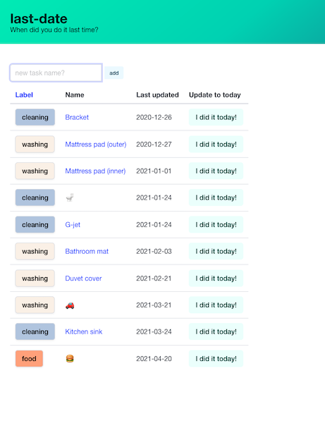
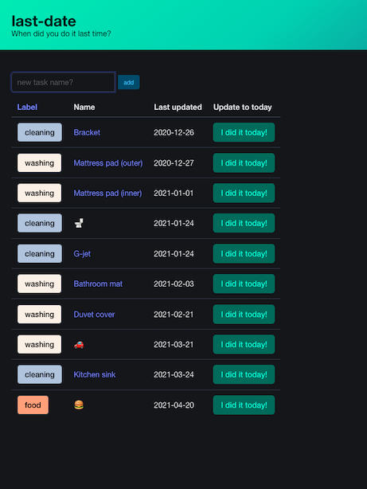

# last-date


Simple ToDo list based on last date I did.




## Purpose

This app's purpose is to remind **me** of forgotten daily tasks like cleaning in specific places (window, shoe case, bed cover, ...).

## Run

First, we have to install `sqlite3`.

```bash
git clone https://github.com/yammmt/last-date.git
cd last-date
cargo run
```

You can access your site by accessing `http://localhost:8000`.

### Production environment

If you want to run this in production environment, for example, run following commands.

```bash
export ROCKET_SECRET_KEY=<your secret key>
cargo run --release
```

You can access your site by accessing `http://<your machine address>:8000`.  
Note that you can generate secret key with `openssl rand -base64 32`.

### For developer

#### Database

To use [Diesel](https://github.com/diesel-rs/diesel) from command line, diesel-cli is needed.

```bash
cargo install diesel_cli --no-default-features --features sqlite
export DATABASE_URL=db/mydb.sqlite # if needed
```

To use database file different from one defined in `Rocket.toml`, set environment variable.

```bash
export ROCKET_DATABASES='{sqlite_database={url="db/mydb.sqlite"}}'
```
Note that this setting is common between `cargo run` and `cargo test`.

#### CSS

This repository uses the CSS framework [Bulma](https://bulma.io/) and Sass.
The procedure to generate css files is the following:

1. Clone submodule repository by `git submodule update --init --recursive`.
1. Move to `static` directory.
1. Update `static/mystyles.scss` file.
1. Generate `static/css/mystyles.css` file by `sass --no-source-map mystyles.scss:css/mystyles.css --style compressed`.

#### Formatter

Use clippy for code lint.

```bash
cargo clippy
```

If you want to work with DB directly, you can use SQLite3 (`sqlite3 db/dev.sqlite`).

```sql
sqlite> INSERT INTO tasks(name,description,updated_at) VALUES ("Eat sushi","Essential to my life!","2020-04-20");
sqlite> SELECT * FROM tasks;
110|Eat sushi|Essential to my life!|2020-04-20
```

## Links

- [Rocket todo example](https://github.com/SergioBenitez/Rocket/tree/master/examples/todo)
    - This app is based on this example :bow:
- CSS framework [Bulma](https://bulma.io/)
