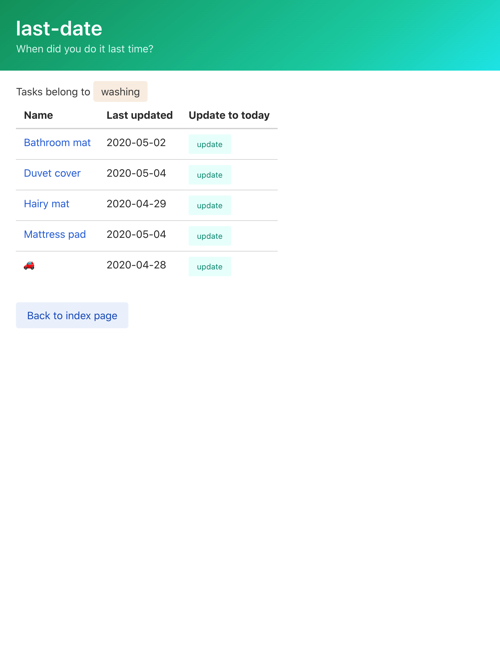
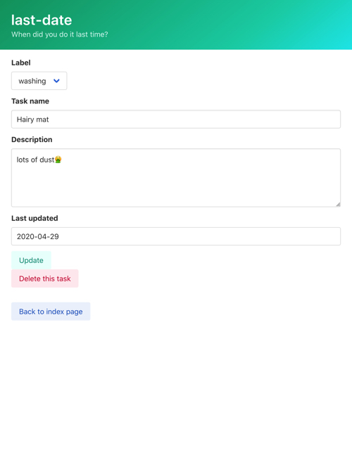
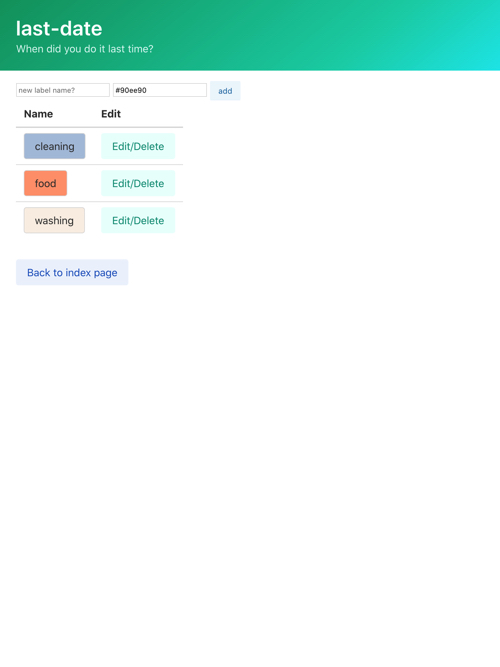
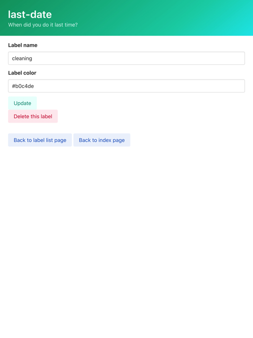

# Usage

This page focuses on the usage of app. If you want to know how to run app, see [README](./README.md).

## Index (root) page

If you access the root of this app, this page appears.  
  
Here,

- All your tasks are shown in ascending order of the "Last updated"
- You can add a new task with the form just above the task list
- You can move to task detail page if you click task name
- You can move to group tasks if you click label button
- You can move to label list page if you click "Label" in table header
- You can update "Last updated" if you click "update" button

## Task

Task is your task. If you want to use this app, you should add your task at first.

### Group tasks with label

As index page shows, we can use labels to group tasks.  

### Add tasks

You can add tasks by submitting the form in the top of index page.

### Update tasks

There are **two** task update paths: for date and for the others.

#### Update "Last updated" date

Click "update" button in index page.

#### Update the other fields

You can update your task name and its description in task detail page, but can't update "Last updated".  

To access task detail page, click your task name in index page.

#### Delete tasks

As button indicates, you can delete your task in task detail page, too.

:warning: You can't restore deleted tasks.

## Label

To group tasks, you can use labels.

### Add labels

Here's a sequence of steps to add your tasks.

1. Click "Label" in table header in index page.
1. Fill in label form in the top of label list page.
    - :warning: You must use six digits hex format for color field (ex. `#FF0000`): don't use `red` or `#F00`.
1. Click "add" button.

### Attach label to tasks

You have to use task detail page. See above task section.

### Update labels

To update your label, click "Edit/Delete" button in label list page and fill in form.  

:warning: You must use six digits hex format for color field (ex. `#FF0000`): don't use `red` or `#F00`.

### Delete labels

As button indicates, you can delete your label in label detail page, too. Same as task.

:warning: You can't restore deleted labels.
